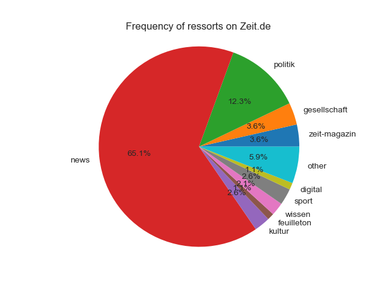
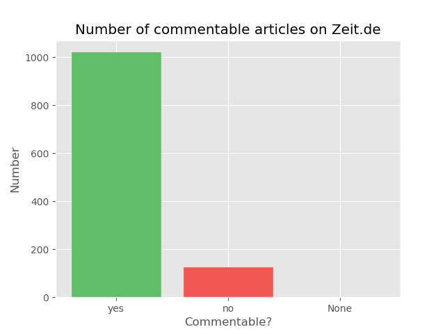

# Zeit-Scraper
### Description
This project downloads every new article from zeit.de in xml, scrapes it and writes the data in a csv table.
My inspiration was a [talk](https://www.youtube.com/watch?v=-YpwsdRKt8Q) from David Kriesel on 33c3. This project
runs on a Raspberry Pi Zero via a scheduled cronjob.

### Installation
1. Install the requirements from `requirements.txt`
```python
pip install -r requirements.txt
```
2. __OPTIONAL:__ Edit the `config.ini` file to use PushNotifier. For more info see [pushnotifier.de](https://pushnotifier.de)
2. Execute the `run.py` file. (`run.py -e` to enable PushNotifier)
3. Have fun with your data!!!

### Screenshot


### Output format
|author|genre|ressort|sub_ressort|edited|...|
|------|-----|-------|-----------|------|---|
|Max Mustermann|Kommentar|Sport|Fussball|Yes|...|

### Sample charts
These charts were made with matplotlib. Source codes in `visualization`.



### Future updates
+ Visualization of the scraped data
  + on a webpage
  + with chart.js
